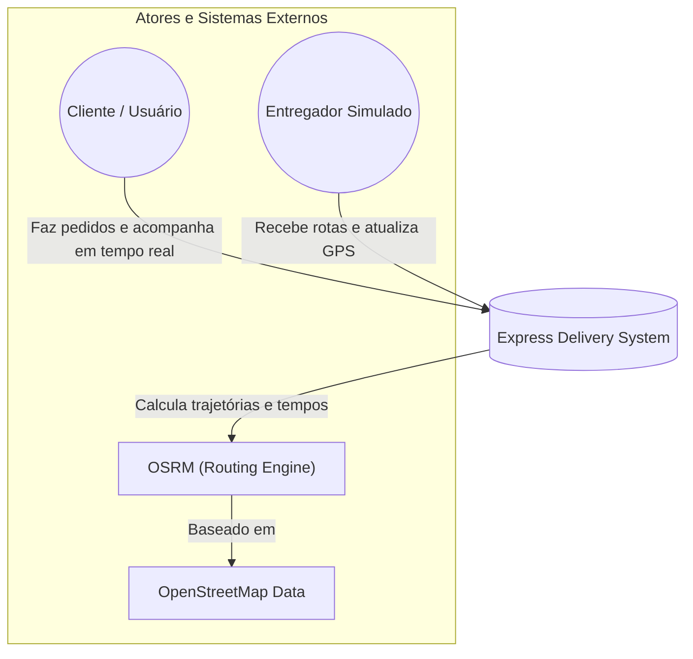
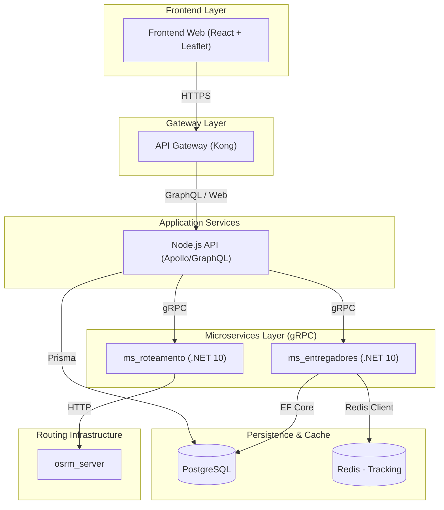

# 📦 Express Delivery - Real-time Microservices Simulation

Este projeto é uma demonstração de alta performance de uma arquitetura baseada em microserviços, projetada para simular um ecossistema de logística em tempo real. A aplicação utiliza dados geográficos reais, comunicação gRPC ultra-rápida e uma interface reativa para orquestrar pedidos e rastreamento de entregadores.

---

## 🏛️ Arquitetura do Sistema (Modelo C4)

Utilizamos o Modelo C4 para descrever a estrutura do sistema, permitindo visualizar desde a interação do usuário até os detalhes técnicos dos serviços.

### Nível 1: Contexto do Sistema (System Context)
O sistema atua como o orquestrador central entre os usuários finais, a frota de entregadores simulada e o motor de roteamento geográfico (OSRM).



### Nível 2: Contêineres (Containers)
Abaixo, a topologia de rede do ecossistema Docker. **Nota:** Todo o tráfego externo é centralizado pelo API Gateway.



---

## 🚀 Como Rodar o Projeto

A aplicação é totalmente conteinerizada com **Docker**. Siga os passos abaixo:

### 1. Pré-requisitos
*   Docker e Docker Compose instalado.
*   Pelo menos 8GB de RAM livre (para o servidor de roteamento OSRM).

### 2. Preparando os Dados de Mapa (OSRM)
1. **Download**: Baixe o mapa do Brasil ou apenas a região Sudeste em [Geofabrik](https://download.geofabrik.de/south-america/brazil.html) (`sudeste-latest.osm.pbf`).
2. **Compilação**: Coloque o arquivo em `./osrm-data/` e execute:
   ```bash
   docker run -t -v "${PWD}/osrm-data:/data" osrm/osrm-backend osrm-extract -p /opt/car.lua /data/seu-arquivo.osm.pbf
   docker run -t -v "${PWD}/osrm-data:/data" osrm/osrm-backend osrm-partition /data/seu-arquivo.osrm
   docker run -t -v "${PWD}/osrm-data:/data" osrm/osrm-backend osrm-customize /data/seu-arquivo.osrm
   ```
3. **Configuração**: Verifique se o nome do arquivo no `compose.yml` (`osrm-server`) condiz com o arquivo gerado (ex: `sudeste-260326.osrm`).

### 3. Execução
```bash
cp .env.example .env
docker compose up --build
```

---

## 🕹️ Manual de Voo: Guia de Simulação

1.  **Acesso**: Acesse `http://localhost:8000`. (O tráfego passa pelo Kong Gateway).
2.  **Login**: Registre-se e faça login. Seu endereço servirá de destino para as entregas.
3.  **Radar**: Observe os entregadores se movendo no mapa. Eles atualizam o **Redis** a cada 3 segundos.
4.  **Compra**: Escolha um restaurante e clique em "Comprar".
5.  **Painel Técnico**: No menu lateral, simule as ações do motoboy para ver o rastreamento em tempo real via **gRPC** e **OSRM**.

> [!CAUTION]
> **Persistência de Dados**: O arquivo `compose.yml` está configurado com `--force-reset`. Isso significa que os dados do banco PostgreSQL são resetados e re-populados (Seed) a cada vez que você sobe o container da API.

---

## 🛠️ Stack Tecnológica

| Componente | Tecnologia | Papel |
| :--- | :--- | :--- |
| **Frontend** | React, Leaflet | UI e visualização de mapas |
| **Gateway** | Kong Gateway | Porta de entrada (Porta 8000), JWT e Rate Limit |
| **API Principal** | Node.js, GraphQL | Orquestração de Microserviços |
| **Microserviços** | .NET 10 (C#), gRPC | Lógica de negócio e alta performance |
| **Dados** | PostgreSQL, Redis | Banco estruturado e Cache de localização |
| **Roteamento** | OSRM Engine | Roteamento baseado em malha viária real |

---

## 📡 Endpoints de Acesso (Via Gateway)
*   **Aplicação Web (Frontend)**: [http://localhost:8000](http://localhost:8000)
*   **GraphQL Playground (API)**: [http://localhost:8000/graphql](http://localhost:8000/graphql)
*   **OSRM (Direto)**: [http://localhost:5080](http://localhost:5080)

---
*Este projeto é parte da disciplina de Arquitetura de Software.*
